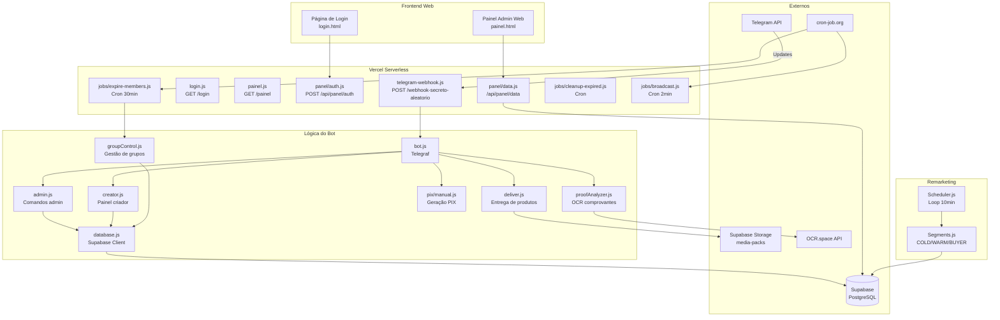
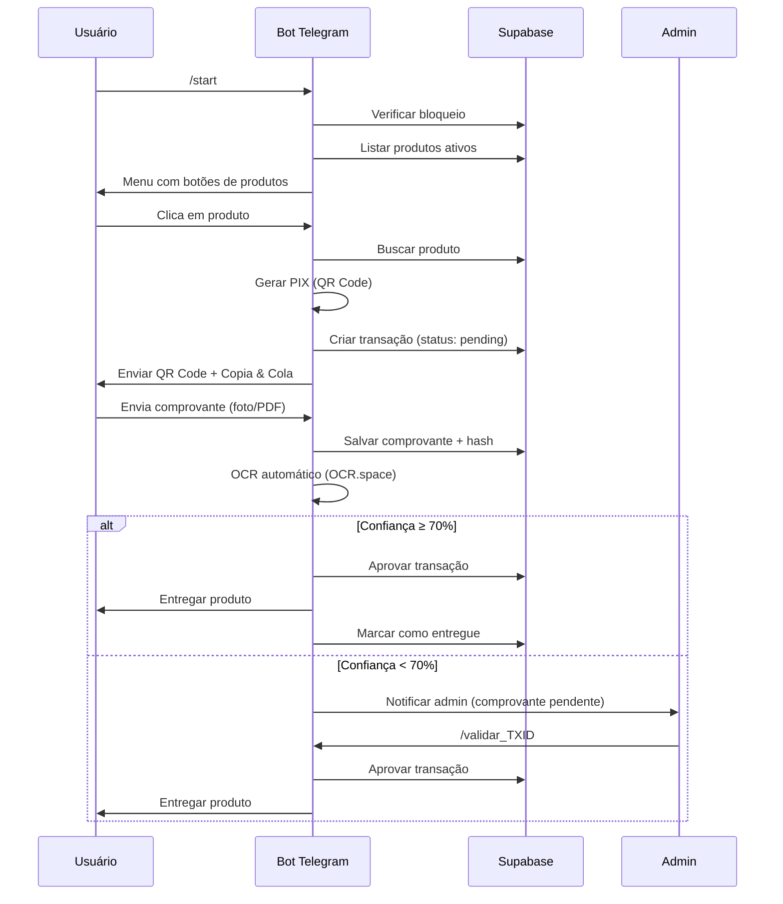

# 🔍 Análise Completa do Projeto — Bot PIX Telegram

## Visão Geral

Este é um **sistema completo de vendas via Telegram** com pagamento PIX e gestão automática de grupos pagos, chamado **"Bot da Val" / "VIPs da Val"**. O bot gerencia produtos digitais, assinaturas de grupos, pagamentos PIX, entregas automáticas e remarketing.

> [!IMPORTANT]
> **Versão:** 2.0.0 | **Status:** Produção
> **Stack:** Node.js 18+ | Telegraf | Supabase (PostgreSQL) | Vercel Serverless

---

## 📁 Estrutura do Projeto

```
Api-Pix-Telegran-main/
├── api/                          # Endpoints Vercel (Serverless Functions)
│   ├── telegram-webhook.js       # Webhook principal do Telegram
│   ├── login.js                  # API de login do painel web
│   ├── painel.js                 # Serve o HTML do painel admin web
│   ├── contrato.js               # Página de contrato
│   ├── sign-contract.js          # Assinatura de contrato
│   ├── check-contract.js         # Verificação de contrato
│   ├── panel/
│   │   ├── auth.js               # Autenticação do painel web
│   │   └── data.js               # API de dados do painel web (CRUD)
│   └── jobs/
│       ├── expire-members.js     # Cron: expiração de membros de grupos
│       ├── cleanup-expired.js    # Cron: limpeza de expirados
│       └── broadcast.js          # Cron: envio de broadcasts em lotes
│
├── src/                          # Código-fonte principal
│   ├── bot.js                    # ⭐ Arquivo principal do bot (3.932 linhas)
│   ├── admin.js                  # Painel administrativo via Telegram (7.839 linhas)
│   ├── creator.js                # Painel do criador de conteúdo (1.636 linhas)
│   ├── database.js               # ⭐ Camada de acesso ao banco (3.874 linhas)
│   ├── deliver.js                # Sistema de entrega de produtos
│   ├── groupControl.js           # Gestão de grupos pagos (assinaturas)
│   ├── proofAnalyzer.js          # OCR automático de comprovantes PIX
│   ├── cache.js                  # Sistema de cache simples
│   ├── pix/
│   │   ├── manual.js             # Geração de cobranças PIX (QR Code)
│   │   └── selectPixKey.js       # Rotação de chaves PIX
│   └── jobs/
│       ├── expireTransactions.js  # Expiração automática de transações
│       ├── sendPaymentReminders.js # Lembretes de pagamento
│       ├── retryDeliveries.js    # Retentar entregas com falha
│       ├── updateBotDescription.js # Atualização da descrição do bot
│       └── backupDatabase.js     # Backup automático
│
├── remarketing/                  # Sistema de remarketing 24/7
│   ├── Scheduler.js              # Motor principal (loop 10 min)
│   ├── Segments.js               # Segmentação de usuários (COLD/WARM/BUYER)
│   ├── Sender.js                 # Envio de mensagens
│   └── Templates.js              # Templates de mensagens
│
├── scripts/
│   └── send_media_delivery.js    # Script para enviar entregas de mídia
│
├── login.html                    # Página de login do painel web
├── painel.html                   # Dashboard administrativo web (45KB)
├── vercel.json                   # Configuração de rotas Vercel
├── package.json                  # Dependências
└── README.md                     # Documentação
```

---

## 🏗️ Arquitetura do Sistema



---

## ⚙️ Módulos Detalhados

### 1. 🤖 Bot Principal ([bot.js](file:///c:/Users/Carlos TJ/Downloads/Api-Pix-Telegran-main/src/bot.js))

O arquivo mais complexo do projeto (3.932 linhas). Gerencia:

| Funcionalidade | Descrição |
|---|---|
| **Comando /start** | Menu principal com listagem dinâmica de produtos, media packs e grupos |
| **Verificação de DDD** | Bloqueio regional de usuários por código de área |
| **Bloqueio individual** | Usuários podem ser bloqueados (is_blocked) |
| **Comprovantes PIX** | Recebe fotos/PDFs, detecta tipo, verifica duplicatas |
| **OCR automático** | Análise de comprovantes via OCR.space |
| **Deep Links** | Suporta links diretos para produtos (`/start produto_PRODUCTID`) |
| **Controle de loja** | Loja pode ser aberta/fechada (setting `shop_enabled`) |
| **Contato obrigatório** | Novo usuário precisa compartilhar telefone |
| **Suporte** | Sistema de tickets integrado |

#### Papéis de Usuário:
- **Criador** (ID hardcoded + DB): `is_creator = true` — Acesso ao painel do criador
- **Admin**: `is_admin = true` — Acesso completo ao painel admin
- **Usuário normal**: Pode comprar produtos e visualizar menu

---

### 2. 🔐 Painel Admin ([admin.js](file:///c:/Users/Carlos TJ/Downloads/Api-Pix-Telegran-main/src/admin.js))

Painel completo via Telegram com 7.839 linhas:

| Opção | Descrição |
|---|---|
| ⏳ Pendentes | Ver transações aguardando aprovação |
| 📦 Entregues | Transações já entregues |
| 📊 Estatísticas | Vendas, usuários, conversão |
| 🛍️ Produtos | CRUD de produtos |
| 👥 Grupos | Gerenciamento de grupos pagos |
| ⚠️ Falhas de Entrega | Retentar entregas com falha |
| 🔑 Alterar PIX | Mudar chave PIX |
| 💳 Rotação PIX | Configurar chave PIX secundária |
| 💬 Suporte | Configurar link de suporte |
| 🎫 Tickets | Gerenciar tickets de suporte |
| ⭐ Usuários Confiáveis | Aprovar automaticamente |
| 🤖 Respostas Automáticas | Configurar auto-respostas |
| 👤 Usuários | Buscar, bloquear, desbloquear |
| 🔓 Gerenciar Bloqueios | Bloqueio por DDD |
| 🏪 Controle da Loja | Abrir/fechar loja |

**Comandos especiais:**
- `/validar_TXID` — Aprovar transação
- `/reverter_TXID` — Reverter transação
- `/buscar_usuario ID` — Buscar info de usuário
- `/relatorio_usuarios` — Relatório completo
- `/broadcast MENSAGEM` — Enviar para todos

---

### 3. 👑 Painel do Criador ([creator.js](file:///c:/Users/Carlos TJ/Downloads/Api-Pix-Telegran-main/src/creator.js))

Versão limitada do painel para criadores de conteúdo:

- 📊 **Estatísticas** — Vendas totais, hoje, mês, mês anterior
- 📢 **CastCupom** — Sistema de broadcast com cupom de desconto
  - Broadcast com produto vinculado
  - Broadcast com produto + cupom automático
  - Deletar promoções ativas

---

### 4. 💰 Sistema PIX ([pix/manual.js](file:///c:/Users/Carlos TJ/Downloads/Api-Pix-Telegran-main/src/pix/manual.js))

Geração de cobranças PIX seguindo a **especificação EMV/BCB (BR Code)**:

- Sanitização inteligente de chaves PIX (telefone, email, CPF, CNPJ, UUID)
- Cálculo correto de CRC16-CCITT
- Geração de QR Code via biblioteca `qrcode`
- **Rotação de chave PIX** via [selectPixKey.js](file:///c:/Users/Carlos TJ/Downloads/Api-Pix-Telegran-main/src/pix/selectPixKey.js) — usa função RPC do Supabase `select_pix_key()` para decidir entre chave primária e secundária

---

### 5. 🔍 Análise de Comprovantes ([proofAnalyzer.js](file:///c:/Users/Carlos TJ/Downloads/Api-Pix-Telegran-main/src/proofAnalyzer.js))

Sistema de OCR automático para validação de comprovantes PIX:

- Usa **OCR.space** (gratuito) com 3 engines diferentes
- Suporta **imagens** (JPG, PNG) e **PDFs**
- Verifica:
  - ✅ Valor do pagamento (margem de ±10%)
  - ✅ Chave PIX (múltiplas tentativas de match)
  - ✅ Palavras-chave (pix, aprovado, comprovante, etc.)
- **Pontuação de confiança:**
  - 70%+ → Aprovação automática
  - 40-69% → Validação manual
  - <40% → Suspeito

---

### 6. 📦 Sistema de Entrega ([deliver.js](file:///c:/Users/Carlos TJ/Downloads/Api-Pix-Telegran-main/src/deliver.js))

- **Entrega via Supabase Storage** — Envia mídias do bucket `media-packs`
- **Entrega por link** — URL de acesso
- **Entrega por arquivo** — Download direto
- **Media Packs** — Itens aleatórios por compra
- **Rastreamento** — Salva `message_id` de cada envio (tabela `messages_sent`)
- **Retry automático** com classificação de erros (blocked/temporary/unknown)
- **Lotes de 10** — Respeita limite do Telegram

#### Mapeamento de Pastas:
```
product_id → pasta no bucket
'destaquesdasemana' → 'semana'
'bastidoresexclusivos' → 'bastidores'
'surpresapremium' → 'surpresa'
'essencialpremium' → 'essencial'
'conteudovip' → 'vip'
'pacotecompleto' → 'completo'
```

---

### 7. 👥 Controle de Grupos ([groupControl.js](file:///c:/Users/Carlos TJ/Downloads/Api-Pix-Telegran-main/src/groupControl.js))

Sistema completo de assinaturas de grupos:

- **Lembretes 3 dias antes** — Com QR Code de renovação
- **Lembrete urgente** — No dia do vencimento
- **Remoção automática** — 1 dia após expiração
- **Lock distribuído** — Evita processamento duplicado
- **Reutilização de transações** — Não cria nova se já existe pendente

---

### 8. 📢 Remarketing ([remarketing/](file:///c:/Users/Carlos TJ/Downloads/Api-Pix-Telegran-main/remarketing))

Motor de remarketing 24/7 com 3 segmentos:

| Segmento | Descrição | Intervalo entre mensagens |
|---|---|---|
| **COLD** 🧊 | Nunca comprou | 6h, 6h, 6h, 12h, 24h (5 mensagens) |
| **WARM** 🔥 | Criou PIX mas não pagou | 2h, 8h, 24h (3 mensagens) |
| **BUYER** 💎 | Já comprou (upsell) | 1d, 3d, 7d, 15d (4 mensagens) |

- Roda a cada **10 minutos**
- Só envia em **horário comercial BR** (8h-22h)
- **Opt-out automático** quando usuário bloqueia o bot
- Batch de **80 usuários** por rodada (seguro para rate limit)
- Usa imagens aleatórias do pack premium

---

### 9. 🌐 Painel Web ([login.html](file:///c:/Users/Carlos TJ/Downloads/Api-Pix-Telegran-main/login.html) + [painel.html](file:///c:/Users/Carlos TJ/Downloads/Api-Pix-Telegran-main/painel.html))

Dashboard web com design moderno (dark mode):

- **Login** via email/senha (autenticação via Supabase Auth)
- **Painel completo** com 45KB de interface
- API REST via [panel/data.js](file:///c:/Users/Carlos TJ/Downloads/Api-Pix-Telegran-main/api/panel/data.js) (48KB de endpoints CRUD)

---

### 10. ⏰ Jobs Automáticos

| Job | Arquivo | Frequência |
|---|---|---|
| Expiração de transações | [expireTransactions.js](file:///c:/Users/Carlos TJ/Downloads/Api-Pix-Telegran-main/src/jobs/expireTransactions.js) | Contínuo |
| Lembretes de pagamento | [sendPaymentReminders.js](file:///c:/Users/Carlos TJ/Downloads/Api-Pix-Telegran-main/src/jobs/sendPaymentReminders.js) | 15 min |
| Retry de entregas | [retryDeliveries.js](file:///c:/Users/Carlos TJ/Downloads/Api-Pix-Telegran-main/src/jobs/retryDeliveries.js) | Contínuo |
| Atualização de descrição | [updateBotDescription.js](file:///c:/Users/Carlos TJ/Downloads/Api-Pix-Telegran-main/src/jobs/updateBotDescription.js) | Diário |
| Backup | [backupDatabase.js](file:///c:/Users/Carlos TJ/Downloads/Api-Pix-Telegran-main/src/jobs/backupDatabase.js) | Periódico |
| Expiração de membros | [expire-members.js](file:///c:/Users/Carlos TJ/Downloads/Api-Pix-Telegran-main/api/jobs/expire-members.js) | Cron 30min |
| Broadcast em lotes | [broadcast.js](file:///c:/Users/Carlos TJ/Downloads/Api-Pix-Telegran-main/api/jobs/broadcast.js) | Cron 2min |

---

## 🔧 Dependências

| Pacote | Versão | Uso |
|---|---|---|
| `@supabase/supabase-js` | ^2.39.0 | Banco de dados e storage |
| `telegraf` | ^4.12.2 | Framework do bot Telegram |
| `axios` | ^1.4.0 | Requisições HTTP (OCR, Telegram API) |
| `qrcode` | ^1.5.1 | Geração de QR Code PIX |
| `dotenv` | ^16.3.1 | Variáveis de ambiente |
| `form-data` | ^4.0.0 | Upload de arquivos para OCR |

---

## 🌐 Rotas Vercel

| Rota | Destino | Métodos |
|---|---|---|
| `/webhook-secreto-aleatorio` | telegram-webhook.js | POST |
| `/contrato` | contrato.js | GET |
| `/api/sign-contract` | sign-contract.js | POST |
| `/api/check-contract` | check-contract.js | GET |
| `/api/jobs/expire-members` | expire-members.js | POST, GET |
| `/api/jobs/cleanup-expired` | cleanup-expired.js | POST |
| `/api/jobs/broadcast` | broadcast.js | POST, GET |
| `/api/panel/auth` | panel/auth.js | GET, POST |
| `/api/panel/data` | panel/data.js | GET, POST, PUT, DELETE |
| `/login` | login.js | GET |
| `/painel` | painel.js | GET |
| `/` | Redireciona → `/login` | 302 |

---

## 🔒 Segurança

- ✅ Validação de assinatura do webhook Telegram (`x-telegram-bot-api-secret-token`)
- ✅ Autenticação por `CRON_SECRET` nos jobs
- ✅ Lock distribuído (evita processamento duplicado)
- ✅ Verificação de comprovantes duplicados (hash SHA-256)
- ✅ Bloqueio por DDD (regional)
- ✅ Bloqueio individual de usuários
- ✅ Retry com backoff exponencial para erros de conexão
- ✅ Classificação de erros (blocked/temporary/unknown)

---

## 🔑 Variáveis de Ambiente Necessárias

```env
# Telegram
TELEGRAM_BOT_TOKEN=
WEBHOOK_SECRET_TOKEN=

# Supabase
SUPABASE_URL=
SUPABASE_SERVICE_KEY=
SUPABASE_ANON_KEY=

# Cron Jobs
CRON_SECRET=

# OCR (opcional)
OCR_SPACE_API_KEY=

# PIX (fallback)
MY_PIX_KEY=

# Bot (remarketing)
BOT_USERNAME=
```

---

## 📊 Fluxo de uma Venda



---

## 📈 Banco de Dados

> [!NOTE]
> Aguardando dados do Supabase para detalhamento completo das tabelas. A seção será atualizada.

### Tabelas Identificadas no Código

| Tabela | Descrição |
|---|---|
| `users` | Usuários do Telegram (telegram_id, username, is_admin, is_creator, is_blocked, phone) |
| `products` | Produtos à venda (product_id, name, price, delivery_type, delivery_url) |
| `transactions` | Transações PIX (txid, status, amount, proof_file_id, proof_hash) |
| `groups` | Grupos pagos do Telegram (group_id, group_name, subscription_price) |
| `group_members` | Membros de grupos (telegram_id, group_id, status, expires_at) |
| `media_packs` | Packs de mídia (pack_id, name, price, items_per_delivery) |
| `media_items` | Itens de mídia individuais (pack_id, file_type, file_url, storage_path) |
| `media_deliveries` | Rastreamento de itens entregues |
| `messages_sent` | Mensagens enviadas (antifraude — permite deleção) |
| `settings` | Configurações dinâmicas (pix_key, shop_enabled, etc.) |
| `coupons` | Cupons de desconto |
| `broadcast_campaigns` | Campanhas de broadcast |
| `broadcast_recipients` | Destinatários de broadcasts |
| `remarketing_log` | Rastreamento de remarketing por usuário |
| `pix_transactions_control` | Log de uso de chaves PIX (rotação) |
| `blocked_area_codes` | DDDs bloqueados |
| `support_tickets` | Tickets de suporte |
| `auto_responses` | Respostas automáticas |
| `trusted_users` | Usuários confiáveis (aprovação automática) |

### Funções RPC do Supabase
- `select_pix_key(p_user_id, p_amount)` — Decide qual chave PIX usar
- `get_warm_users(batch_size, now_ts)` — Busca usuários warm para remarketing
- `increment_remarketing_sent(uid)` — Incrementa contador de remarketing

---

## ⚠️ Observações e Potenciais Melhorias

> [!WARNING]
> ### Pontos de Atenção
> 1. **Arquivos muito grandes** — `bot.js` (3.932 linhas), `admin.js` (7.839 linhas), `database.js` (3.874 linhas) dificultam manutenção
> 2. **IDs de criadores hardcoded** — `CREATOR_TELEGRAM_ID = 7147424680` e `SECOND_CREATOR_ID = 6668959779` no código
> 3. **Middleware duplicado** — O middleware de log no `bot.js` está registrado 2 vezes (linhas 425-445 e 554-574)
> 4. **Chave OCR no código** — API key do OCR.space está hardcoded como fallback
> 5. **Mapeamento estático de pastas** — `PRODUCT_FOLDER_MAP` no deliver.js precisa atualização manual

> [!TIP]
> ### Sugestões de Melhoria
> 1. **Modularizar** os arquivos grandes em submódulos menores
> 2. **Remover IDs hardcoded** — Usar apenas a tabela `settings` do banco
> 3. **Adicionar TypeScript** — Melhor documentação e prevenção de erros
> 4. **Testes automatizados** — Atualmente só tem `test-bot-local.js`
> 5. **Rate limiting** — Adicionar proteção contra flood no webhook
> 6. **Mover mapeamento de pastas** — Para o banco de dados (configuração dinâmica)
